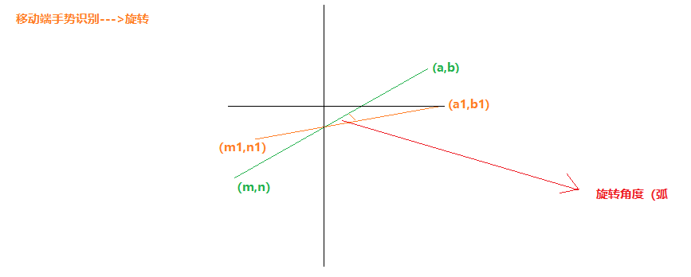

**移动端手势识别-常见的几种应用的原理**

1.旋转

2.缩放

3.方向锁定

4.下拉刷新

**旋转**
原理：如图，  旋转角度为黄线与垂直线的夹角-绿线与垂直线的夹角

至于它们的夹角怎么算呢？这里用到了极其高深的的初中数学知识(笑哭)tanα = (a-m)/(n-b);
 α=Math.atan2((n-b),(a-m))*180/Math.PI(因为这里指的是弧度,所以要乘180/Math.PI);
 下面是一个具体的例子：
 ```
 <!DOCTYPE html>
 <html>
   <head>
     <meta charset="utf-8">
     <meta name="viewport" content="width=device-width,user-scalable=no,initial-scale=1.0,maximum-scale=1.0">
     <title>移动端手势识别-旋转原理</title>
     <style media="screen">
       * {margin:0;padding:0;}
       .box {width:150px;height:150px;background-color:green;margin:50px auto;transform: rotate(0deg);}
     </style>
   </head>
   <body>
     <div class="box"></div>
     <script type="text/javascript">
       let oBox = document.querySelector(".box");
       let old_Ang = 0;
       oBox.addEventListener("touchstart",function(ev){
         if(ev.targetTouches.length>=2){
           let a = ev.targetTouches[0].clientX-ev.targetTouches[1].clientX;
           let b = ev.targetTouches[0].clientY-ev.targetTouches[1].clientY;
           let Ang = Math.atan2(b,a)*180/Math.PI;
           let StartAng = old_Ang;
           ev.preventDefault();
         }
         function FnMove(ev){
           if(ev.targetTouches.length>=2){
             let a = ev.targetTouches[0].clientX-ev.targetTouches[1].clientX;
             let b = ev.targetTouches[0].clientX-ev.targetTouches[1].clientY;
             let Ang2 = Math.atan2(b,a)*180/Math.PI;
             let old_Ang = StartAng+Ang-Ang2;
             this.style.transform = `transform(${old_Ang}deg)`;
           }
         }
         function FnEnd(){
           oBox.removeEventListener("touchmove",FnMove,false);
           oBox.removeEventListener("touchend",FnEnd,false);
         }
           oBox.addEventListener("touchmove",FnMove,false);
           oBox.addEventListener("touchend",FnEnd,false);
       },false);
     </script>
   </body>
 </html>

 ```
 **缩放**
 原理：如图 手指从黄线的位置到绿线的位置,对应的矩形比例没变，从而可以计算出缩放后的矩形宽高

 
 同样，一个具体的例子：
 ```
 <!DOCTYPE html>
 <html>
   <head>
     <meta charset="utf-8">
     <title>移动端手势-缩放原理</title>
     <meta name="viewport" content="width=device-width,user-scalable=no,initial-scale=1.0,maximum-scale=1.0">
     <style media="screen">
     *{margin:0;padding:0}
     .box {width: 150px;height: 150px;background-color: green;margin:50px auto;transform: scale(0deg);}
     </style>
   </head>
   <body>
     <div class="box"></div>
     <script type="text/javascript">
       let oBox = document.querySelector(".box");
       oBox.addEventListener("touchstart",function(ev){
         ev.preventDefault();
           let a = ev.targetTouches[0].clientX - ev.targetTouches[1].clientX;
           let b = ev.targetTouches[0].clientY - ev.targetTouches[1].clientY;
           let dis = Math.sqrt(Math.pow(a,2)+Math.pow(b,2));
           let w = oBox.offsetWidth;
           let h = oBox.offsetHeight;
         function FnMove(ev){
           if(ev.targetTouches.length>=2){
             let a = ev.targetTouches[0].clientX - ev.targetTouches[1].clientX;
             let b = ev.targetTouches[0].clientY - ev.targetTouches[1].clientY;
             let dis2 = Math.sqrt(Math.pow(a,2)+Math.pow(b,2));
             oBox.style.width = w/dis*dis2 + "px";
             oBox.style.height = h/dis*dis2 + "px";
           }
         }
         function FnEnd(){
           oBox.removeEventListener("touchmove",FnMove,false);
           oBox.removeEventListener("touchend",FnEnd,false);
         }
         if(ev.targetTouches.length>=2){
           ev.preventDefault();
           oBox.addEventListener("touchmove",FnMove,false);
           oBox.addEventListener("touchend",FnEnd,false);
         }
       },false)
     </script>
   </body>
 </html>
 ```
 **方向锁定与下拉刷新加载**

 所谓“方向锁定”指的是,当用户手指向下滑动页面的时候就不能左右滑动页面，相反，左右滑动页面的时候则不能上下滑动页面，有一个方向是锁定的。如果你对我说的有点疑惑，可以打开淘宝客户端滑动试试(我本人之前是没有感觉到存在方向锁定的问题)，这也应了一句话，“最好的用户体验是用户完全感觉不到的”。

 怎么判断用户是想上下滑动还是左右滑动呢？很简单，定个标准，当左右滑动距离大于5时认为用户是左右滑，当上下滑动距离大于5时，认为用户是上下滑。
 当然，下拉刷新也是在此基础上顺便可以实现的，因为我们已经确定了滑动方向。

 具体例子请访问我的GitHub地址
 https://github.com/clearlivings/Direction-lock-and-drop-load
